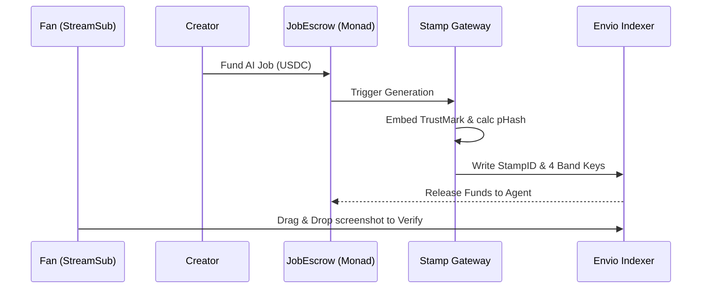

# Stamp
*A creator platform where every AI-made file carries a verifiable origin (Monad Metropolis, Track 04).*

**The Problem:** Provenance metadata (C2PA) is instantly destroyed when an image is screenshotted, cropped, or re-compressed on social media. Fans cannot tell human art from AI, and creators cannot prove ownership.

**The Solution:** Stamp inextricably links payment, generation, and watermarking. Agents are paid via smart contracts to generate art; getting paid triggers an invisible pixel-level watermark and perceptual fingerprint, which are permanently logged on Monad.

**Why Monad?** Stamping individual images requires high-frequency, low-latency micro-transactions. Monad's parallel execution and near-zero fees make a high-volume provenance registry economically viable.

## How it works
- Layer 1: invisible watermark (Adobe TrustMark, 40-bit stampId, built-in ECC)
- Layer 2: pHash fingerprint, 8 bands x 8 bits (lookup guaranteed up to Hamming 7)
- Registry: ProvenanceRegistry on Monad testnet, indexed by Envio

## Watermark test results
10 AI-generated images (mixed styles), each stamped, then attacked. Single run, random IDs, n=10: results moved by 1-4 images between runs.

| Attack | TrustMark decoded | invisible-watermark (best variant) | pHash median distance |
|---|---|---|---|
| none | 10/10 | 10/10 | 0 |
| JPEG q40 | 8/10 | 0/10 | 0 |
| resize 50% | 10/10 | 10/10 | 0 |
| crop 20% | 9/10 | 0/10 | 22 |
| screenshot (75% shrink + blur + JPEG 70) | 9/10 | 0/10 | 0 |
| crop + JPEG q40 | 4/10 | 0/10 | 22 |
| crop + screenshot | 7/10 | 0/10 | 22 |
| resize 50% + crop + JPEG q40 | 1/10 | 0/10 | 22 |

- Unrelated images sit 20-44 apart in pHash. Match threshold: 7.
- pHash does not survive crops (22 is inside the stranger range), so cropped copies rely on the watermark.
- Known limits: stacked attacks (crop + JPEG, resize + crop + JPEG) often defeat the watermark. This is a provenance signal, not proof of authenticity.
- False positives on never-stamped images: 0/30.

## Status
## Status
- [x] **Watermark + pHash Core Spike:** Completed (`worker/stampcore.py`)
- [x] **Agent Identity Registry (ERC-8004):** Completed (`contracts/src/AgentRegistry.sol`)
- [x] **Provenance Registry Contract:** Completed (`contracts/src/ProvenanceRegistry.sol`)
- [ ] **JobEscrow Payment System:** In Progress
- [ ] **Envio Indexer & Gateway Connection:** Next
- [ ] **Verify Page UI & Browser Login:** Next

## Run the worker
<<<<<<< HEAD
Python 3.10. On Windows run this first in PowerShell: $env:PYTHONUTF8="1"
Then: pip install -r worker/requirements.txt
Put test images in imgs/ (not committed), then: python worker/spike2.py
=======
Python 3.10. On Windows run this first in PowerShell: `$env:PYTHONUTF8="1"`
Then: `pip install -r worker/requirements.txt`
Put test images in imgs/ (not committed), then: `python worker/spike2.py`

## Bounties Claimed
* **Monad Track 04 (Trust, Identity & AI):** Core submission. Solves agent identity (ERC-8004) and provenance that survives re-encoding.
* **Best Use of Envio:** HyperIndex watches the `ProvenanceRegistry` and indexes pHash bands for zero-gas similarity lookups via GraphQL.
>>>>>>> 2fefceb643d79d2919059ec164a13de984a9ff95
